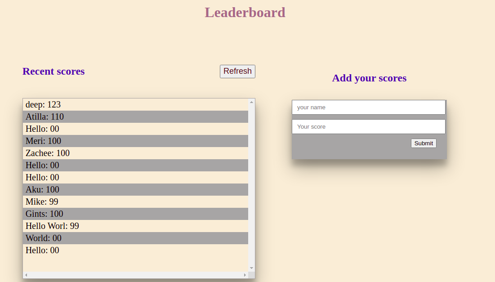

## Leaderboard

This activity is about the Leaderboard list app, using JavaScript, webpack and ES6 modules.
the app is wireframe only.

## Built With

- HTML
- CSS
- JavaScript.
- Webpack.

## Live Demo

- Not yet live.

## Getting Started

- Steps to follow:

- create a dir and cd into that dir.

- Clone this repository to your locaL machine with git clone command. It should look similar to this git clone https://github.com/aakbarkhan/Leaderboard .

- In the root dir, run 'npm install' to install app dependencies.

- Next, run 'npm start'.

##  Author 1 - aku

- GitHub: aakbarkhan.

## Contributing

- Contributions, issues, and feature requests are welcome!

## Show your support

- Give a star if you like this project!

## Acknowledgments

- Thanks to my teammates, learning and coding partners.

## License

-This project is MIT licensed.
